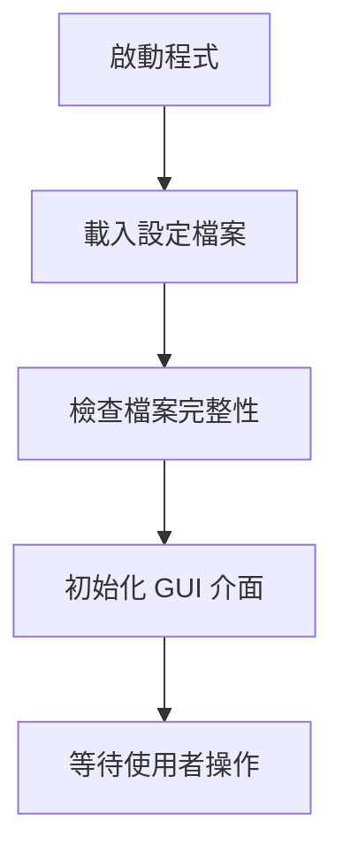
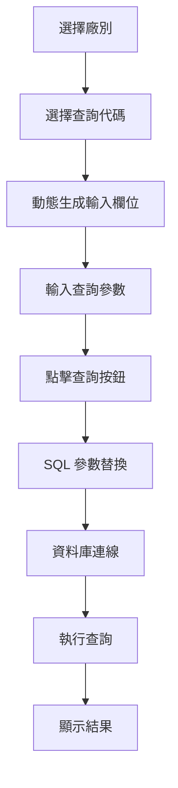

# ERP SQL 查詢工具 (ERP SQL Query Tool)

## 📋 專案概述

這是一個完整的 ERP SQL 查詢工具，採用 Python tkinter 開發的圖形化使用者介面，用於執行預定義的 SQL 查詢並顯示結果。

## 🎯 主要功能

### 1. 多廠別支援
- 支援多個廠別資料庫連線
- 動態切換不同的資料庫環境
- 自動替換 SQL 中的廠別相關參數

### 2. 動態查詢介面
- 下拉選單選擇查詢代碼
- 根據選擇的查詢自動生成輸入欄位
- 支援不同類型的輸入參數

### 3. SQL 查詢執行
- PostgreSQL 資料庫支援
- 自動參數替換和 SQL 生成
- 查詢結果以表格形式顯示

### 4. 資料匯出功能
- Excel 檔案匯出
- 自動郵件發送功能
- 支援多種資料格式

### 5. 檔案轉換工具
- Excel 轉 YAML
- YAML 轉 Excel
- 支援複雜的巢狀資料結構

## 🏗️ 技術架構

### 核心技術棧
```python
- tkinter & ttk: GUI 框架
- pandas: 資料處理和分析
- SQLAlchemy: 資料庫 ORM
- pandastable: 表格元件
- openpyxl: Excel 檔案處理
- PIL/Pillow: 圖片處理
- smtplib: 郵件發送
```

### 檔案結構
```
📁 專案目錄/
├── 📄 sql005.py          # 主程式
├── 📁 xlsx/
│   ├── 📄 subno.xlsx     # 廠別設定檔案
│   └── 📄 input.xlsx     # SQL 模板檔案
└── 📁 images/            # 圖片資源目錄
```

## 📊 資料流程

### 1. 程式初始化


### 2. 查詢執行流程


## 🔧 設定檔案格式

### subno.xlsx 結構
| 欄位 | 說明 | 範例 |
|------|------|------|
| subno | 廠別名稱 | T.天津廠, B.雲林廠 |
| connection | 資料庫連線資訊 (JSON) | {"host": "...", "user": "..."} |
| replace1 | SQL 替換字串1 | '1' as subno,'B' as factory |
| replace2 | SQL 替換字串2 | kumes, kcmes |

### input.xlsx 結構
| 欄位 | 說明 | 範例 |
|------|------|------|
| code | 查詢代碼 | A001, B001 |
| Chinese | 中文說明 | ['起始日期', '結束日期'] |
| input | 輸入參數鍵值 | ['input1', 'input2'] |
| input_width | 輸入框寬度 | [8, 8] |
| sql | SQL 模板 | SELECT ... FROM ... |
| note | 查詢說明 | PostgreSQL 相關說明 |

## 💻 使用說明

### 基本操作流程

1. **啟動程式**
   ```bash
   python sql005.py
   ```

2. **選擇廠別**
   - 從下拉選單選擇目標廠別
   - 系統會自動載入對應的資料庫連線設定

3. **選擇查詢代碼**
   - 從查詢代碼下拉選單選擇
   - 系統自動更新視窗標題和生成輸入欄位

4. **輸入查詢參數**
   - 根據查詢需求填入必要參數
   - 系統會驗證必填欄位

5. **執行查詢**
   - 點擊「查詢」按鈕
   - 系統執行 SQL 並顯示結果

6. **匯出結果**
   - 使用「Excel存檔」功能
   - 或使用「發送E-mail」功能

## 🔍 關鍵功能詳解

### 動態 SQL 替換機制

程式根據選擇的廠別自動替換 SQL 語法中的特定部分：

```sql
-- 原始 SQL 模板
SELECT '7' as subno,'L' as factory,
       ... FROM kt2mes.collect_record ...

-- 替換後 (以 B.雲林廠為例)
SELECT '1' as subno,'B' as factory,
       ... FROM kumes.collect_record ...
```

### 圖片顯示功能

支援根據廠別和查詢代碼顯示對應的說明圖片：

```
圖片命名規則: {廠別前綴}-{查詢代碼}.png
範例: B-A001.png, T-B002.png
```

## 🐛 錯誤處理

程式包含完整的錯誤處理機制：

- **檔案遺失檢查**: 啟動時檢查必要檔案
- **資料庫連線驗證**: 連線失敗時顯示錯誤訊息
- **SQL 執行錯誤**: 顯示詳細的錯誤資訊
- **輸入驗證**: 檢查必填欄位是否已填寫

## 🚀 部署需求

### 系統需求
- Python 3.8+
- PostgreSQL 資料庫
- Windows/Linux/macOS

### 必要套件
```txt
pandas>=1.3.0
SQLAlchemy>=1.4.0
pandastable>=0.13.0
openpyxl>=3.0.0
Pillow>=8.0.0
PyYAML>=5.0.0
```

### 安裝指令
```bash
pip install pandas sqlalchemy pandastable openpyxl pillow pyyaml
```

## 📝 開發者資訊

### 程式架構
- **MVC 模式**: 將資料、介面、邏輯分離
- **模組化設計**: 各功能模組獨立
- **設定檔案驅動**: 靈活的設定管理

### 程式碼組織
```python
# 1. 初始化設定
# 2. GUI 元件定義
# 3. 業務邏輯函數
# 4. 主程式迴圈
```

## 🔧 自訂與擴展

### 新增查詢模板
1. 在 `input.xlsx` 中新增列
2. 定義查詢代碼、說明和 SQL 模板
3. 設定輸入參數格式

### 新增廠別支援
1. 在 `subno.xlsx` 中新增廠別設定
2. 設定資料庫連線資訊
3. 定義 SQL 替換規則

## 📞 技術支援

如需技術支援或功能增強，請參考程式內的錯誤訊息和日誌輸出進行除錯。

---

**版本**: 1.0
**更新日期**: 2024年12月
**開發語言**: Python 3.x
**GUI 框架**: tkinter
